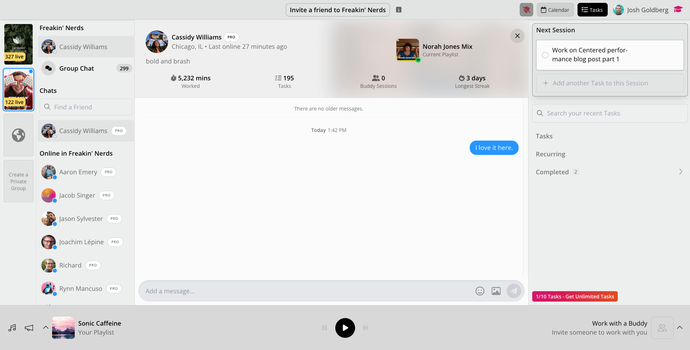
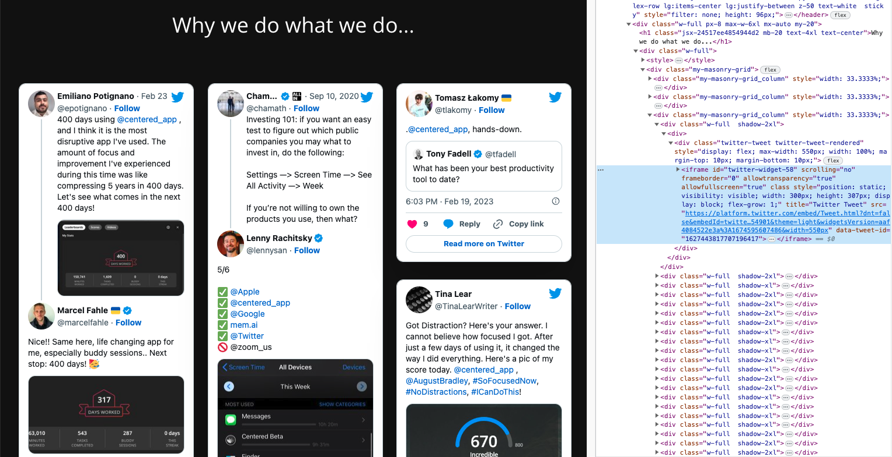
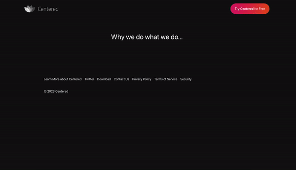

Page performance is an essential part of any web application.
Poor page performance results in worsened SEO, user retention, and general website pleasantness.
But when you're a startup working quickly to implement critical user features, it's easy to let "performance paper cuts" pile up over time.

> ✨ Tip: See [web.dev/why-speed-matters](https://web.dev/why-speed-matters) for a more thorough explanation of why page performance is important.

<small style="display:block;margin-bottom:2rem;text-align:center;">

<div>Your users are not Mr. Bean. Don't make them wait to use your website. [<a aria-label="Spongebob gif source" href="https://giphy.com/gifs/waiting-mr-bean-checking-time-pFZTlrO0MV6LoWSDXd" target="_blank">source</a>]</div>
</small>

This post is the first in a series describing how I significantly improved the page load performance of the popular [Centered app](https://centered.app).
For each improvement, I'll cover:

1. **Identification**: how I used developer tools at a high level to identify where there was an issue
2. **Investigation**: using more tooling to dig deeper into what the root cause of the issue was
3. **Implementation**: the actual code change I made to address the performance issue
4. **Confirmation**: observing that the fixes improved the production app as expected

The net results were quite pleasing:

-   ~80% reduction in bundle size loaded on all pages
-   ≥2 second reduction in all pages' load script processing

This post covers the first of six key improvements I made to the Centered app:

1. 👉 81 &lt;iframe&gt; Embeds
1. _Hidden Embedded Images: coming soon!_
1. _Unused Code Bloat: coming soon!_
1. _Emoji Processing Time: coming soon!_
1. _Bucket Imports: coming soon!_

Let's dig in!

## Centered?

First, let's cover some context: what is Centered and why was I looking into it?

Centered is a web app that provides a suite of tools to help you get into high productivity ("flow") states.
It provides nice background music, reminders, task tracking, and coach-led group working sessions.
I'm a fan - and would recommend trying it out if you haven't yet.

<small style="display:block;margin-bottom:2rem;text-align:center;">

<div><em>Using the Centered app, in group lovingly titled "Freakin' Nerds".</em></div>
</small>

Centered has excellent user _retention_ -users who get into it stay using it- but not as good _acquisition_: getting new users to try it.
I was first connected to Centered by [Cassidy Williams](https://cassidoo.co), an advisor to the Centered team and coach voice on the app, in the context of brainstorming how to improve their user acquisition.

My first instinct as a web developer is to check web apps for serious SEO issues such as poor accessibility or performance.

## Issue 1: The Quotes Page

The first issue I looked at on was the [centered.app/quotes](https://centered.app/quotes) marketing page.
It contains 81 `<iframe>` embeds of tweets from various happy users.
The team had noticed the page takes a long time to load and spikes the user's CPU in the process.

I tried visiting centered.app/quotes, and ... wow!
They were right.
It was _aggravatingly_ slow.

<small style="display:block;margin-bottom:2rem;text-align:center;">

<div><em>2x sped up recording of loading centered.app/quotes</em></div>
</small>

On my Mac Mini with an M1 Max chip, the page took _ten seconds_ to populate page content.
Yikes!
Users tend to abandon pages after ~2-3 seconds at most, let alone double digits.

I'm guessing this particular page had started off with only a small number of quotes to load, then slowly expanded and slowed down over time.

### 1. Identification

Normally at the beginning of an investigation I'll run a tool such as the [Chrome dev tools > Lighthouse performance audit](https://developer.chrome.com/docs/devtools/lighthouse) to get an overview of a page's performance issues.
But this page page was straightforward enough that I felt I could run off my past experiences and intuition.

The page's HTML, CSS, and JavaScript all loaded pretty quickly: so the issue was client-side, rather than the server taking a long time to send them over.
That meant the issue was most likely some client scripts taking too long to run.

Problem identified.
Next step: investigating what was running on the client.

### 2. Investigation

I took a look at the DOM structure of the page to see what was being created.
What I saw amused me: dozens upon dozens of `<iframe>`s, each embedding one of the tweets shown on the page!

<small style="display:block;margin-bottom:2rem;text-align:center;">

<div><em>Each of the w-full divs contains an &lt;iframe&gt;. That's a lot of &lt;iframe&gt;s.</em></div>
</small>

Fun fact: each `<iframe>` in a web page causes the browser to recreate what is essentially a webpage-in-a-webpage, complete with its own DOM body and JavaScript execution environment.
Placing several dozen `<iframe>`s immediately on a single webpage is almost the equivalent of opening that many browser tabs all at the same times.

Even worse, each `<iframe>`'s JavaScript runs in the same thread as its parent.
Having multiple sub-pages run their page startup routines simultaneously can be disastrous for page loading times!

Investigation complete: there were too many `<iframe>`s loading with the page.
Next step: reducing that number.

### 3. Implementation

One of the most common techniques in performance work is _lazy loading_: loading content only when it is needed.
In web pages, that often means loading only content _"above the fold"_ -content the user can see without scrolling- initially, then loading subsequent content as the user scrolls down.
The quotes page only really needed the first half dozen or so tweets to load immediately.

I opted for a variant sometimes called _"over-eager loading"_: loading the initial content first, then "eagerly" loading in more and more content later.
You can think of over-eager loading as an optimization over _"lazy loading"_.
In lazy loading, content isn't loaded until it's needed.
In over-eager loading, not-yet-needed content is still not loaded immediately, but it is "preloaded" after the main content.

> ✨ Tip: A more common example of over-eager loading is pre-fetching HTTP resources with [`<link rel="preload">`](https://developer.mozilla.org/en-US/docs/Web/HTML/Attributes/rel/preload).

The code change roughly boiled down to incrementing a counter in state tracking how many cards should be shown:

```diff
+ const startingCardsCount = 6;
+
export default function Cards(): JSX.Element {
  const cards = useSocialCards();

+ const [loadedCount, setLoadedCount] = useState(0)
+ const onCardLoad = () => setLoadedCount((previous) => previous + 1)

  return (
    <>
      {cards
+       // We exponentially increase the number of cards shown as they load in
+       // This way we don't load potentially dozens of <iframe> embeds at once
+       .slice(0, startingCardsCount + loadedCount * 1.5)
        .map((card) => (
            <Card
                key={card.id}
                {...card}
+               onLoad={onCardLoad}
            />
        ))}
    </>
  );
}
```

I had it start with 6 cards and increment by `loadedCount * 1.5` for a couple of reasons:

-   Exponential growth: after the user loaded the first few rows, their browser was likely more ready to load even more
-   Resiliency: a single card failing to load wouldn't stop other cards from incrementing the count

The numbers are arbitrary, but what's important is that the page was waiting to load later `<iframe>`s until after earlier ones.

Next step: confirming the page's improved loading behavior.

### 4. Confirmation

This change was straightforward to verify.
I loaded the quotes page with the code changes and immediately noticed a drastic improvement in perceived load time.
The general time from page load to all visible content loading was reduced from &gt;10 seconds to &lt;3 seconds.

<small style="display:block;margin-bottom:2rem;text-align:center;">

<div><em>1x recording of loading centered.app/quotes with the over-eager loading</em></div>
</small>

The page still has a bit of choppiness as the frames load in, but that's a touchup for another day.
I'm satisfied with the 300% speedup result for now.
⚡️

## In Conclusion

Web performance is easy to neglect when you've got other pressing concerns to handle.
But pages that may have been fine one year may slowly turn slow over time.

Strategies such as lazy loading and over-eager loading can trim those bloated webpages back to speedier versions of themselves.

### Acknowledgments

Many thanks to:

-   [Cassidy Williams](https://cassidoo.co) for connecting us in the first place
-   [Steven Puri](https://twitter.com/stevenpuri) for great initial chats about the product _(plus real enthusiasm about making a great product!)_ and [Michael Cash](https://twitter.com/mikecashatx) for helping continue that onboarding
-   [Nicolas Carlo](https://www.nicoespeon.com) for reviewing my PRs into the Centered repository

### Coming Soon

In later posts, I'll dive deeper into using dev tools and more intricate code strategies to detect and fix deeper issues.
Look forward to them later this summer!
✨
