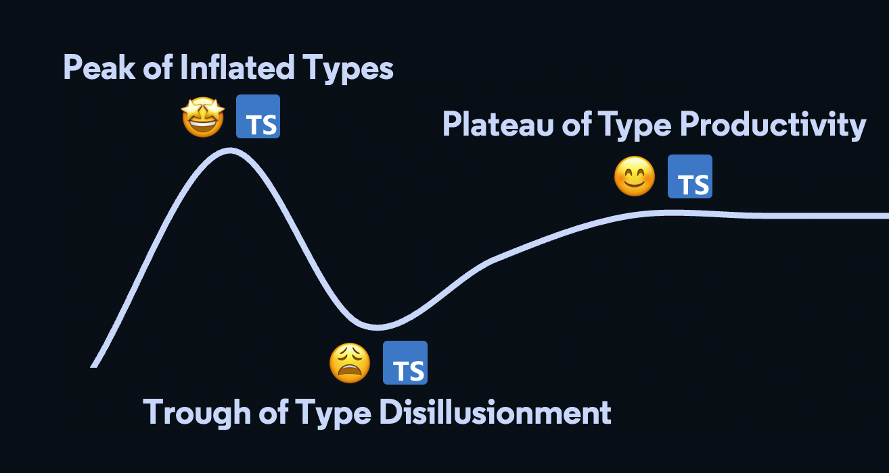

The [Gartner Hype Cycle](TODO) is a cycle TODO.
It describes how new (technologies?) tend to go through three public vibes, in order:

1. **Peak of Inflated Expectations**: The technology is the latest new hotness and everybody loves using it for everything
2. **Trough of Disillusionment**: Users discover its flaws the hard way - especially when using it in areas it's not optimal for
3. **Plateau of Productivity**: The community settles on optimal ways to use the technology

TypeScript -and its type system in particular- are no exception to the Gartner Hype Cycle.
Most users who learn TypeScript go through a reminiscent cycle of their own:

1. **Peak of Inflated Types**: Using far too many fancy TypeScript type system features
2. **Trough of Type Disillusionment**: Struggling with those very same type system features
3. **Plateau of Productive Types**: Learning to reign in usage of those types, only using them when necessary

I've affectionately called this the **TypeScript Type Cycle**.



<em style="display:block;margin-bottom:2rem;text-align:center;">
A visualization of the TypeScript Type Cycle.
<br />
</em>

## Peak of Inflated Types 🤩

TypeScript's type system is a beauty to behold.
Once you understand conditional types, generics, and mapped types, it's a ton of fun to play around with.

Many developers go overboard with those type system features upon first understanding them.
Take a look at the types that enable the following `exclaim` function's return type to be more specific if the type of `data.happy` is known:

```ts
interface MessageData<M extends string> {
    happy: boolean;
    message: M;
}

type ExclaimedHappy<M extends string> = `It's happy! ${M}`;

type ExclaimedUnhappy<M extends string> = `Not so happy: ${M}`;

type ExclaimedMessage<
    M extends string,
    MD extends MessageData<M>
> = MD["happy"] extends true
    ? ExclaimedHappy<M>
    : MD["happy"] extends false
    ? ExclaimedUnhappy<M>
    : ExclaimedUnhappy<M> | ExclaimedHappy<M>;

function exclaim<M extends string, MD extends MessageData<M>>(data: MD) {
    return (
        data.happy
            ? `It's happy! ${data.message}`
            : `Not so happy: ${data.message}`
    ) as ExclaimedMessage<M, MD>;
}

// Type: "It's happy! ..."
exclaim({ happy: true, message: "apple" });

// Type: "Not so happy: ..."
exclaim({ happy: false, message: "banana" });

// Type: "It's happy! ..." | "Not so happy: ..."
exclaim({ happy: Math.random() > 0.5, message: "cherry" });
```

This is some cool stuff!
The `exclaim` types may seem wild and wacky -especially if you're not familiar with those fancier type system features- but they enable great precision in describing expected function returns and object shapes in code.

> Baffled by that code snippet?
> You're not alone.
> I cover the features it uses in [_Learning TypeScript_](https://www.learningtypescript.com)'s **Chapter 15: Type Operations**.

## Trough of Type Disillusionment 😩

Those wild and wacky types come at a cost.
They’re harder to write, harder to read, and much harder to debug.
The joy first felt when writing complex types descends into despair when needing to work with the wild and wacky.

Developers are especially prone to falling into the Trough of Type Disillusionment when they have to maintain those types over time.
It often turns out many of the generics and conditional types they used during the Peak of Inflated Types were unnecessary and over-inflated code complexity.
Consider this correct and wise quote on writing and then debugging complex code:

> "Debugging is twice as hard as writing the code in the first place.
> Therefore, if you write the code as cleverly as possible, you are, by definition, not smart enough to debug it."
>
> _—Brian Kernighan_

Complex TypeScript features are particularly prone to perplexing programmers for a few reasons:

-   Their syntax is different from what we normally code in, and therefore
-   Developers typically only use them rarely, so information can be quickly forgotten
-   There is no common tooling for debugging through type system types _(yet!)_

Don't despair

## Plateau of Productive Types 😊

TODO

Don't be clever with your types.
Be as simple as possible.

TODO

For example, the `exclaim` snippet from before can be rewritten to remove the conditional return type:

```ts
interface MessageData {
    happy: boolean;
    message: string;
}

function exclaim(data: MessageData) {
    return data.happy
        ? `It's happy! ${data.message}`
        : `Not so happy: ${data.message}`;
}
```

### Tips for TODO

-   TODOfull names exacmple `MessageData<Message extends string>`

> I see a lot of code from newly capable TypeScript developers that violates the [Golden Rule of Generics](https://effectivetypescript.com/2020/08/12/generics-golden-rule), like

## Further Reading

I ideated this concept while working on my Adventures in _Type Safe Prisma Clients_ talk at Prisma Day 2022 [slides](https://1drv.ms/p/s!AvUc1cvPrJnWvtQLoqKbcgSfwfAZYw?e=fR6JqZ "Prisma Day 2022 slides")] [[video](https://www.youtube.com/watch?v=uFj4qsyGvH0&ab_channel=Prisma "Prisma Day 2022 video)]
